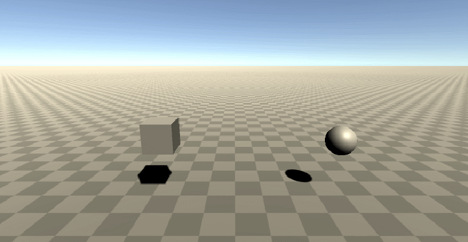
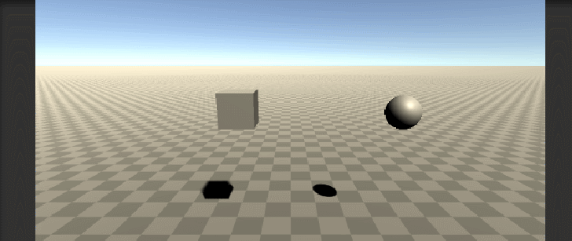
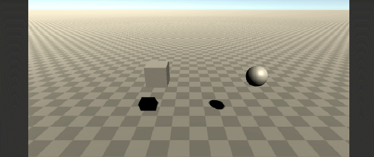
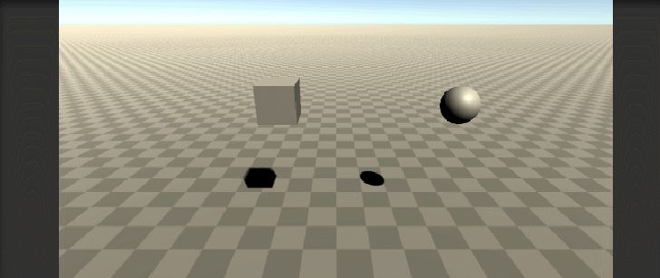
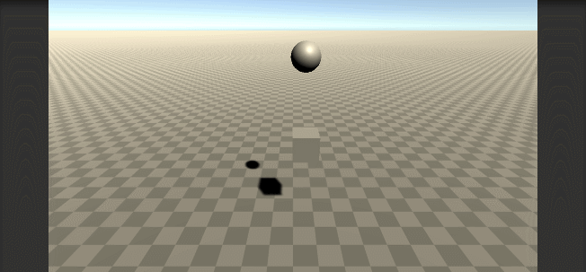
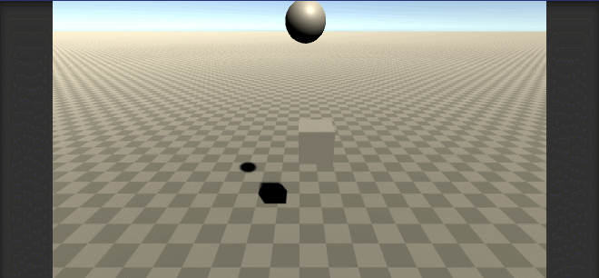

# Interfaces Inteligentes - Práctica 2

## Crear una escena simple sobre la que probar diferentes configuraciones de objetos físicos en Unity. La escena debe tener un plano a modo de suelo, una esfera y un cubo.

### Ninguno de los objetos será físico:

Para comprobar este punto con una mayor claridad, elevé los objetos y puse en marcha la escena.

Podemos comprobar que los cuerpos, al no depender de físicas, se quedan estáticos en su posición inicial.

- ### La esfera tiene físicas, el cubo no:

Aquí podemos comprobar que la esfera, al tener propiedades físicas, es atraida hacia abajo por la fuerza de la gravedad, solo siendo frenada por el terreno.

- ### La esfera y el cubo tienen físicas:

Aquí se ve lo anteriormente mencionado, pero esta vez con ambos cuerpo.

- ### La esfera y el cubo son físicos y la esfera tiene 10 veces la masa del cubo:

La nueva masa del objeto cubo no va a afectar a la aceleración de la velocidad, por lo que este, seguirá bajando a la misma velocidad que antes.

- ### La esfera tiene físicas y el cubo es de tipo IsTrigger:

Lo que he intentado representar en esta escena es que, al no ser un cuerpo físico, la esfera es capaz de atravesar al cubo, pero la cualidad que tiene este último es la capaz de detectar que otro objeto ha colisionado con él, dando así la posibilidad programar el evento que ocurrirá al realizar tal acción.

- ### La esfera tiene físicas, el cubo es de tipo IsTrigger y tiene físicas:

Lo que ocurre aquí es que el cubo, al no tener programado ninguna reacción al colisionar con otro cuerpo, por defecto los atraviesa.

- ### La esfera y el cubo son físicos y la esfera tiene 10 veces la masa del cubo, se impide la rotación del cubo sobre el plano XZ.

Lo que ocurre al no bloquear la rotación del cubo sobre el plano XZ es que, al impactar la circunsferencia sobre su esquina, este se ve forzado a realizar una rotación.

En cambio, al bloquear la rotación, al impactar de la misma manera la esfera, el cubo se queda estático en las posiciones X y Z iniciales.

