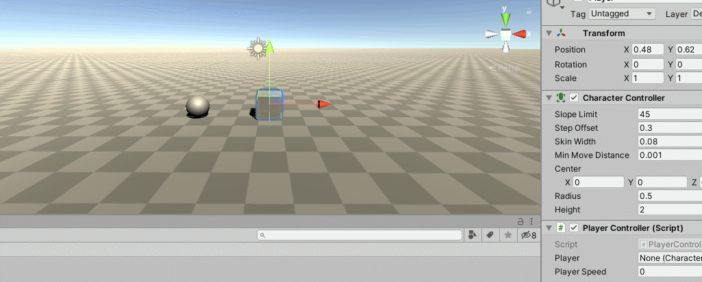
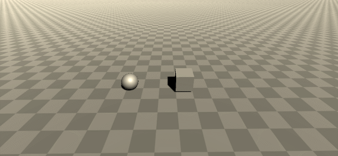
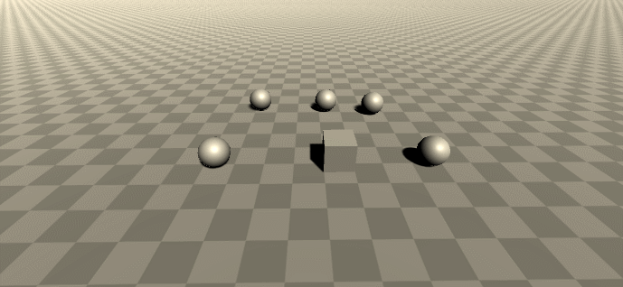
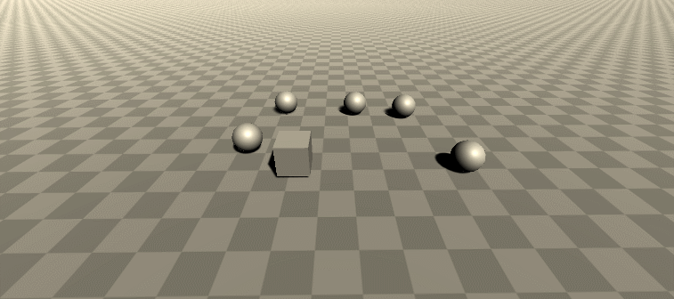
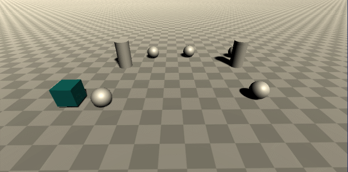
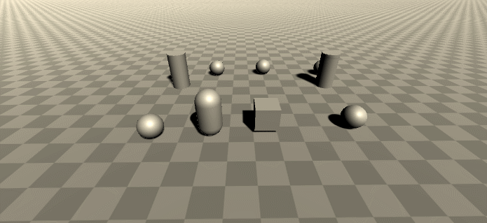
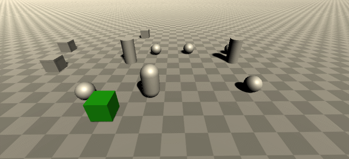
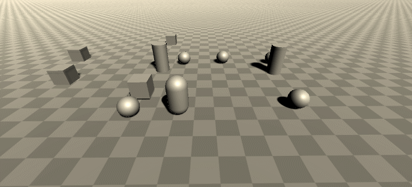

# Interfaces Inteligentes - Práctica 2

## Crear una escena simple sobre la que probar diferentes configuraciones de objetos físicos en Unity. La escena debe tener un plano a modo de suelo, una esfera y un cubo.

### Ninguno de los objetos será físico:

Para comprobar este punto con una mayor claridad, elevé los objetos y puse en marcha la escena.

Podemos comprobar que los cuerpos, al no depender de físicas, se quedan estáticos en su posición inicial.

- ### La esfera tiene físicas, el cubo no:

Aquí podemos comprobar que la esfera, al tener propiedades físicas, es atraida hacia abajo por la fuerza de la gravedad, solo siendo frenada por el terreno.

- ### La esfera y el cubo tienen físicas:

Aquí se ve lo anteriormente mencionado, pero esta vez con ambos cuerpos.

- ### La esfera y el cubo son físicos y la esfera tiene 10 veces la masa del cubo:

La nueva masa del objeto cubo no va a afectar a la aceleración de la velocidad, por lo que este, seguirá bajando a la misma velocidad que antes.

- ### La esfera tiene físicas y el cubo es de tipo IsTrigger:

Lo que he intentado representar en esta escena es que, al no ser un cuerpo físico, la esfera es capaz de atravesar al cubo, pero la cualidad que tiene este último es la capaz de detectar que otro objeto ha colisionado con él, dando así la posibilidad programar el evento que ocurrirá al realizar tal acción.

- ### La esfera tiene físicas, el cubo es de tipo IsTrigger y tiene físicas:

Lo que ocurre aquí es que el cubo, al no tener programado ninguna reacción al colisionar con otro cuerpo, por defecto los atraviesa.

- ### La esfera y el cubo son físicos y la esfera tiene 10 veces la masa del cubo, se impide la rotación del cubo sobre el plano XZ.

Lo que ocurre al no bloquear la rotación del cubo sobre el plano XZ es que, al impactar la circunsferencia sobre su esquina, este se ve forzado a realizar una rotación.

En cambio, al bloquear la rotación, al impactar de la misma manera la esfera, el cubo se queda estático en las posiciones X y Z iniciales.

## Sobre la escena que has trabajado ubica un cubo que represente un personaje que vas a mover. Se debe implementar un script que haga de CharacterController. Cuando el jugador pulse las teclas de flecha (o aswd) el jugador se moverá en la dirección que estos ejes indican.

## Elegir otros ejes virtuales para el giro y girar al jugador sobre el eje OY (up).

Los botones que seleccioné para rotar son Y y O.

## Se deben incluir varias esferas sobre la escena. Cada vez que el objeto jugador colisione con una esfera se debe cambiar su color.

Para poder atender a este ejercicio tuve que acceder al método OnCollisionEnter.

## Si se trata de una esfera de tipo A, y se pulsa la barra espaciadora el jugador impulsa la esfera hacia fuera de él.

Lo que hice fue acceder al método OnCollisionStay y cada vez que se pulsa la barra espaciadora, el cubo envia a la esfera en el eje x hacia donde se está moviendo.

## Las esferas deben responder a la física. Se deben incluir cilindros que se alejen del jugador cuando esté próximo.

Lo que hice para que los cilindros se desplazasen en dirección contraria al jugador fue, convertirlos en onTrigger y aumenté el tamaño de sus collaider, de manera que cuando detecta al jugador dentro de su área, son repelidos.

## Ubicar un tercer objeto que sea capaz de detectar colisiones y que se mueva con las teclas: I, L, J, M.

## Debes ubicar cubos que que aumentan de tamaño cuando se le acerca una esfera.

La idea que tuve fue muy similar a lo de los cilindros, pero esta vez con el tamaño de los cubos.

## Y que disminuye cuando se le acerca el jugador.

# [Para consultar el codigo](Scripts)